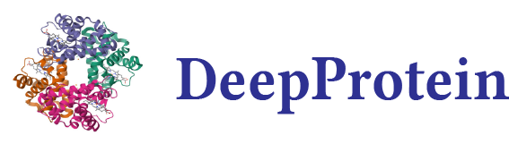

<p align="center"></p>
<h3 align="center">
<p> DeepPurpose 2.0 : A Benchmark Study on Learning Based Protein Discovery<br></h3>
<h4 align="center">
<p> ... </h4>


pip install lmdb 


### 1. Protein Function (Property) Prediction


Done: 
1. Dataset Built for: Fluorescence Dataset 

test on the CNN probing on the Fluorescence dataset

```python
python CNN_Fluroscence.py
```

test on the GCN probing on the Fluorescence dataset

```python
python GCN_Fluroscence.py
```


TODO: 
1. ProtBert test on Fluorescence Dataset 
2. ProtAlbert test on Fluorescence Dataset
3. ESM-Gearnet test on Fluorescence Dataset
3. Transformer test on Fluorescence Dataset
4. Flow test on Fluorescence Datasets

```python
python test.py
```
