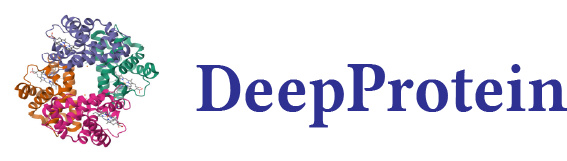

<p align="center"></p>

---

<h3 align="center">
  [DeepProtein: Deep Learning Library and Benchmark for Protein Sequence Learning](https://arxiv.org/abs/2410.02023, Bioinformatics)
</h3>

<h4 align="center">
  Applications in Protein Property Prediction, Localization Prediction, Protein-Protein Interaction, Antigen Epitope Prediction, Antibody Paratope Prediction, Antibody Developability Prediction, and more.
</h4>

---

## Introduction

Understanding proteomics is critical for advancing biology, genomics, and medicine. Proteins perform essential roles, such as catalyzing biochemical reactions and providing immune responses. With the rise of 3D databases like AlphaFold 2.0, machine learning has become a powerful tool for studying protein mechanisms.

### Why DeepProtein?

Deep learning has revolutionized tasks such as:
1. Protein-protein interaction
2. Protein folding
3. Protein-ligand interaction
4. Protein function and property prediction

However, current benchmarks often focus on sequential methods like CNNs and transformers, overlooking graph-based models and lacking user-friendly interfaces.

---

### What is DeepProtein 2.0?

**DeepProtein 2.0** is the torch-first runtime of DeepProtein. It keeps the benchmark and task coverage of the original project while moving the maintained graph path onto `torch-geometric` instead of DGL.

In practice, the current 2.0 line focuses on:

1. **Torch-only core runtime**: the maintained graph workflow now runs through `PyG_GCN`, `PyG_GAT`, `PyG_GraphSAGE`, `PyG_GIN`, `PyG_ChebNet`, and `PyG_TAGConv`.
2. **Unified task coverage**: single-protein, pair/PPI, and residue-level tasks stay under one library surface.
3. **Practical training entry points**: CLI scripts, dataset loaders, and smoke tests are aligned to the v2 runtime.

More broadly, **DeepProtein** remains a comprehensive deep learning library and benchmark designed to fill these gaps:

1. **Comprehensive Benchmarking**: Evaluating CNNs, RNNs, transformers, and GNNs on 7 essential protein learning tasks, such as function prediction and antibody developability.
2. **User-friendly Interface**: Simplifying execution with one command for all tasks.
3. **Enhanced Accessibility**: Extensive documentation and tutorials for reproducible research.


<p align="center"></p>

---

## News
- [04/25] DeepProtein is accepted at Bioinformatics (under publication).
- [03/25] DeepProtein now published three notebooks of dataset loading, training and inference with DeepProtT5 (colab).
- [03/25] DeepProtein is now under the second round review at Bioinformatics.
- [03/25] DeepProtein now supports Fold and Secondary Structure Dataset
- [03/25] DeepProtein: Files under the train folders are now simplified, also code in Readme.md file.
- [03/25] DeepProtein has now released DeepProtT5 Series Models, which can be found at https://huggingface.co/collections/jiaxie/protlm-67bba5b973db936ce90e7d54
- [02/25] DeepProtein now supported BioMistral, BioT5+, ChemLLM_7B, ChemDFM, and LlaSMol on some tasks
- [12/24] The documentation of DeepProtein is still under construction. It's at https://deepprotein.readthedocs.io/
- [12/24] DeepProtein is going to be supported with pretrained shallow DL models.
- [12/24] DeepProtein now supports BioMistral-7B model, working on [BioT5+, BioT5, ChemLLM, and LlaSMol]
- [12/24] DeepProtein now supports four new Protein Language Models: ESM-1-650M, ESM-2-650M, Prot-Bert and Prot-T5 Models for Protein Function Prediction.
- [11/24] DeepProtein is accepted at NeurIPS AI4DrugX as Spotlight. It's under revision at Bioinformatics.


---

## Installation

The commands below reflect the recommended **DeepProtein 2.0** environment. The project still shares several dependencies with DeepPurpose, but the maintained graph backend in v2 is `torch-geometric`.
```bash
conda create -n DeepProtein python=3.9
conda activate DeepProtein
pip install git+https://github.com/bp-kelley/descriptastorus
pip install lmdb seaborn wandb pydantic DeepPurpose
pip install transformers bitsandbytes 
pip install accelerate>=0.26.0
pip install SentencePiece einops rdchiral peft
pip install numpy==1.23.5 pandas==1.5.3 scikit-learn==1.2.2
pip install datasets
conda install -c conda-forge pytdc
```

A version of torch 2.1+ is required to be installed since Jul requires a version of torch >=2.1.0. 

1. If you want to use GPU, then first find a matched torch version. We give an example of torch 2.3.0 with cuda 11.8:
    ```bash
   pip install torch==2.3.0 torchvision==0.18.0 torchaudio==2.3.0 --index-url https://download.pytorch.org/whl/cu118
   pip install torch-geometric
   ```
2. If you are not using a GPU, then follow this:
    ```bash
    pip install torch==2.3.0 torchvision==0.18.0 torchaudio==2.3.0 --index-url https://download.pytorch.org/whl/cpu
    pip install torch-geometric
    ```

DeepProtein 2.0 removes the DGL requirement from the core package. Phases II and III add torch-geometric support for both single-protein and pair/PPI graph encoders, including `PyG_GCN`, `PyG_GAT`, `PyG_GraphSAGE`, `PyG_GIN`, `PyG_ChebNet`, and `PyG_TAGConv`. Phase V adds optional Laplacian positional encoding for the `PyG_*` graph path through `compute_pos_enc=True`. Legacy `DGL_*` graph encoders are kept as unsupported compatibility stubs.

## Demos

Checkout some demos & tutorials to start, which are available in Google Colab:

| Name                                                                                                                                       | Description                                                        |
|--------------------------------------------------------------------------------------------------------------------------------------------|--------------------------------------------------------------------|
| [Dataset Tutorial](https://colab.research.google.com/drive/1-irfVeXjuwF-bVONN9xTj9dr6eRLET6Y?usp=sharing)                                  | Tutorial on how to use the dataset loader and read customized data |
| [Single Protein Regression](https://colab.research.google.com/drive/1RD9qTpkP7m5oSHhjTD7gJQNw6wfLzJrY?usp=sharing)                         | Example of CNN on Beta-lactamase property prediction               |
| [Single Protein Classification](https://colab.research.google.com/drive/1RD9qTpkP7m5oSHhjTD7gJQNw6wfLzJrY?usp=sharing)                     | Example of ProtT5 on SubCellular property prediction               |
| [Protein Pair Regression](https://colab.research.google.com/drive/1RD9qTpkP7m5oSHhjTD7gJQNw6wfLzJrY?usp=sharing)                           | Example of Transformer on PPI Affinity prediction                  |
| [Protein Pair Classification](https://colab.research.google.com/drive/1RD9qTpkP7m5oSHhjTD7gJQNw6wfLzJrY?usp=sharing)                       | Example of ProtT5 on Human_PPI Affinity prediction                 |
| [Residual-Level Classification](https://colab.research.google.com/drive/1RD9qTpkP7m5oSHhjTD7gJQNw6wfLzJrY?usp=sharing)                     | Example of Token_CNN on PDB prediction                             |
| [Inference of DeepProtT5 models on all above tasks](https://colab.research.google.com/drive/1k0xFLNajWwX8nd5Q2y9YtkvpL_hyRGRB?usp=sharing) | Example of DeepProtT5 on Fold Structure prediction                 |
| [Personalized data ](https://colab.research.google.com/drive/1eFJ31UdQLuCMDTVXSC7lCVu4RUCTdKL3?usp=sharing)                                | Example of personalized data load and train                        |

## Example

We give two examples for each case study. One is trained with fixed parameters (a) and one is trained with argument. The argument list is given below.


| Argument  | Description                                                                                                                                                                                                                                                                                                                                                                                                                                                |
|-----------------|------------------------------------------------------------------------------------------------------------------------------------------------------------------------------------------------------------------------------------------------------------------------------------------------------------------------------------------------------------------------------------------------------------------------------------------------------------|
| target_encoding             | DeepProtein 2.0 supports torch-only protein encoders such as 'CNN', 'Transformer', 'CNN_RNN', 'prot_t5', 'esm_1b', 'esm_2', and 'prot_bert', plus torch-geometric graph encoders 'PyG_GCN', 'PyG_GAT', 'PyG_GraphSAGE', 'PyG_GIN', 'PyG_ChebNet', and 'PyG_TAGConv' for both single-protein and pair/PPI tasks. Legacy graph encoders such as 'DGL_GCN', 'DGL_GAT', 'DGL_AttentiveFP', 'DGL_NeuralFP', 'DGL_MPNN', 'PAGTN', and 'Graphormer' are not available in the v2 runtime. For residue level tasks, the protein encoding list is ['Token_CNN', 'Token_CNN_RNN, 'Token_Transformer'] |
| seed         | For paper: 7 / 42 /100. You could try your own seed.                                                                                                                                                                                                                                                                                                                                                                                                       |
| wandb_proj     | The name of your wandb project that you wish to save the results into.                                                                                                                                                                                                                                                                                                                                                                                     |
| lr          | Learning rate. We recommend 1e-4 for non-GNN learning and 1e-5 for GNN learning.                                                                                                                                                                                                                                                                                                                                                                           |
| epochs         | Number of training epochs. Generally setting 60 - 100 epochs leads to convergence.                                                                                                                                                                                                                                                                                                                                                                         |
| compute_pos_enc *    | Enable Laplacian node positional encoding for `PyG_*` graph encoders in both single-protein and pair/PPI workflows. Keep this flag as `False` for non-graph encoders. The PE width is controlled by `generate_config(..., pyg_pos_enc_dim=8)`.                                                                                                                                     |
| batch_size | Batch size of 8 - 32 is good for protein sequence learning.                                                                                                                                                                                                                                                                                                                                                                                                |


### Case Study 1(a): A Framework for Protein Function (Property) Prediction 
<details>
  <summary>Click here for the code!</summary>

```python
### Our library DeepProtein
from DeepProtein.load_dataset import *
import DeepProtein.ProteinPred as models

### Load Beta lactamase dataset
path = os.getcwd()
train, val, test = load_single_dataset("Beta", path, 'CNN')

                            
### Load configuration for model
config = generate_config(target_encoding='CNN',
                         cls_hidden_dims=[1024, 1024],
                         train_epoch=20,
                         LR=0.0001,
                         batch_size=32,
                         )
config['multi'] = False
torch.manual_seed(42)
model = models.model_initialize(**config)

### Train our model
model.train(train, val, test, compute_pos_enc = False)
model.model
```

</details>

If you want to use structure learning methods such as graph neural network, choose a `PyG_*` encoder. You can additionally enable Laplacian positional encoding with `compute_pos_enc=True`.

(b) If you wish to use arguments, this could be trained in one line. All mentioned GNN variants above is available for training.

<details>
  <summary>CNN Case</summary>

```python 
python train/beta.py --target_encoding CNN --seed 7 --wandb_proj DeepProtein --lr 0.0001 --epochs 100
```

</details>
<details>
  <summary>GNN Case</summary>

```python 
python train/beta.py --target_encoding PyG_GCN --seed 7 --wandb_proj DeepProtein --lr 0.00001 --epochs 100 --compute_pos_enc True
```

</details>

### Case Study 1(b): A Framework for Protein Protein Interaction Prediction 
<details>
  <summary>Click here for the code!</summary>

```python
### Our library DeepProtein
from DeepProtein.load_dataset import *
import DeepProtein.PPI as models

### Load PPI Affinity dataset
path = os.getcwd()
train, val, test = load_pair_dataset("PPI_Affinity", path, 'PyG_GCN')
                            
### Load configuration for model
config = generate_config(target_encoding='PyG_GCN',
                         cls_hidden_dims=[512],
                         train_epoch=20,
                         LR=0.00001,
                         batch_size=32,
                         )
# config['multi'] = False
torch.manual_seed(42)
model = models.model_initialize(**config)

### Train our model
model.train(train, val, test, compute_pos_enc = True)

```
</details>

Pair/PPI graph methods are now available through torch-geometric. `PyG_GCN`, `PyG_GAT`, `PyG_GraphSAGE`, `PyG_GIN`, `PyG_ChebNet`, and `PyG_TAGConv` all share the same encoder tower across the two proteins, and can optionally consume Laplacian positional encoding with `compute_pos_enc=True`.


<details>
  <summary>CNN Case</summary>

```python 
python train/ppi_affinity.py --target_encoding CNN --seed 42 --wandb_proj DeepProtein --lr 0.0001 --epochs 100
```

</details>
<details>
  <summary>GNN Case</summary>

```python 
python train/ppi_affinity.py --target_encoding PyG_GCN --seed 42 --wandb_proj DeepProtein --lr 0.00001 --epochs 100 --compute_pos_enc True
```

</details>


### Case Study 1(c): A Framework for Protein Localization Prediction 
<details>
  <summary>Click here for the code!</summary>

```python
### Our library DeepProtein
from DeepProtein.load_dataset import *
import DeepProtein.ProteinPred as models

### Load Subcellular Dataset
path = os.getcwd()
train, val, test = load_single_dataset("SubCellular", path, 'CNN')
                            
### Load configuration for model
config = generate_config(target_encoding='CNN',
                         cls_hidden_dims=[1024, 1024],
                         train_epoch=20,
                         LR=0.0001,
                         batch_size=32,
                         )
config['binary'] = False
config['multi'] = True
config['classes'] = 10
torch.manual_seed(42)
model = models.model_initialize(**config)

### Train our model
model.train(train, val, test, compute_pos_enc = False)

```

</details>

If you want to use structure learning methods such as graph neural network, choose a `PyG_*` encoder and optionally enable `compute_pos_enc=True`. Note that SubCellular is multi-class classification problem, therefore you should set config['multi'] to True.

(b) If you wish to use arguments, this could be trained in one line. All mentioned GNN variants above is available for training.

<details>
  <summary>CNN Case</summary>

```python 
python train/subcellular.py --target_encoding CNN --seed 7 --wandb_proj DeepProtein --lr 0.0001 --epochs 100
```

</details>
<details>
  <summary>GNN Case</summary>

```python 
python train/subcellular.py --target_encoding PyG_GAT --seed 7 --wandb_proj DeepProtein --lr 0.00001 --epochs 100 --compute_pos_enc True
```
</details>

### Case Study 1(d): A Framework for Antigen Epitope Prediction
Make sure that tdc is installed, if not 
```bash
conda install -c conda-forge pytdc
```
<details>
  <summary>Click here for the code!</summary>

```python
### Our library DeepProtein
from DeepProtein.load_dataset import *
import DeepProtein.TokenPred as models

### Load Epitope  Dataset
train, val, test = load_residue_dataset("IEDB", None, 'Token_CNN')

### Load configuration for model
config = generate_config(target_encoding='Token_CNN',
                         cls_hidden_dims=[1024, 1024],
                         train_epoch=20,
                         LR=0.0001,
                         batch_size=32,
                         )
config['multi'] = False
config['binary'] = True
config['token'] = True
config['in_channels'] = 24
torch.manual_seed(42)
model = models.model_initialize(**config)

### Train our model
model.train(train, val, test, compute_pos_enc = True)

```

</details>


(b) If you wish to use arguments, this could be trained in one line. All mentioned GNN variants above is not available for training. For an important notice, this task is residue (token) level classification therefore we deploy token level CNN, CNN_RNN and Transformer models.

Current version only supports Token_CNN, Token_CNN_RNN and Token_Transformer for target_encoding.

<details>
  <summary>CNN Case</summary>

```python 
python train/IEDB.py --target_encoding Token_CNN --seed 7 --wandb_proj DeepProtein --lr 0.0001 --epochs 100
```

</details>

### Case Study 1(e): A Framework for Antibody Paratope Prediction
Make sure that tdc is installed, if not 
```bash
conda install -c conda-forge pytdc
```
<details>
  <summary>Click here for the code!</summary>

```python
### Our library DeepProtein
from DeepProtein.load_dataset import * 
import DeepProtein.TokenPred as models

### Load Paratope Dataset
train, val, test = load_residue_dataset("SAbDab_Liberis", None, 'Token_CNN')

### Load configuration for model
config = generate_config(target_encoding='Token_CNN',
                         cls_hidden_dims=[1024, 1024],
                         train_epoch=20,
                         LR=0.0001,
                         batch_size=32,
                         )
config['multi'] = False
config['binary'] = True
config['token'] = True
config['in_channels'] = 20
torch.manual_seed(42)
model = models.model_initialize(**config)

### Train our model
model.train(train, val, test, batch_size=32)

```

</details>

 

(b) If you wish to use arguments, this could be trained in one line. All mentioned GNN variants above is not available for training. For an important notice, this task is residue (token) level classification therefore we deploy token level CNN, CNN_RNN and Transformer models.

Current version only supports Token_CNN, Token_CNN_RNN and Token_Transformer for target_encoding.

<details>
  <summary>CNN Case</summary>

```python 
python train/SAbDab_Liberis.py --target_encoding Token_CNN --seed 7 --wandb_proj DeepProtein --lr 0.0001 --epochs 100
```

</details>


### Case Study 1(f): A Framework for Antibody Developability Prediction (TAP)
Make sure that tdc is installed, if not 
```bash
conda install -c conda-forge pytdc
```
<details>
  <summary>Click here for the code!</summary>

```python
### Our library DeepProtein
from DeepProtein.load_dataset import *
import DeepProtein.PPI as models

### Load TAP Dataset
train, val, test = load_pair_dataset("TAP", None, 'PyG_GAT')

### Load configuration for model
config = generate_config(target_encoding='PyG_GAT',
                         cls_hidden_dims=[1024, 1024],
                         train_epoch=20,
                         LR=0.00001,
                         batch_size=32,
                         )
config['binary'] = False
config['multi'] = False
torch.manual_seed(42)
model = models.model_initialize(**config)


### Train our model
model.train(train, val, test, batch_size=32)
```

</details>


Pair/PPI graph methods are also available for TAP-style pair tasks through the same `PyG_*` encoder family, including optional Laplacian positional encoding via `compute_pos_enc=True`.

<details>
  <summary>CNN Case</summary>

```python 
python train/TAP.py --target_encoding CNN --seed 7 --wandb_proj DeepProtein --lr 0.0001 --epochs 100
```

</details>

<details>
  <summary>GNN Case</summary>

```python 
python train/TAP.py --target_encoding PyG_GAT --seed 7 --wandb_proj DeepProtein --lr 0.00001 --epochs 100 --compute_pos_enc True
```

</details>


### Case Study 1(g): A Framework for Repair Outcome Prediction (CRISPR)

Make sure that tdc is installed, if not 
```bash
conda install -c conda-forge pytdc
```
<details>
  <summary>Click here for the code!</summary>

```python
### Our library DeepProtein
from DeepProtein.load_dataset import *
import DeepProtein.ProteinPred as models

### Load CRISPR Leenay Dataset
train, val, test = load_single_dataset("CRISPR", None, 'CNN')

### Load configuration for model
config = generate_config(target_encoding='CNN',
                         cls_hidden_dims=[1024, 1024],
                         train_epoch=20,
                         LR=0.0001,
                         batch_size=32,
                         )
config['binary'] = False
config['multi'] = False
torch.manual_seed(42)
model = models.model_initialize(**config)

### Train our model
model.train(train, val, test, batch_size=32)
```

</details>


If you want to use structure learning methods such as graph neural network, choose a `PyG_*` encoder and optionally enable `compute_pos_enc=True`.

(b) If you wish to use arguments, this could be trained in one line. Torch-geometric methods such as `PyG_GCN`, `PyG_GAT`, `PyG_GraphSAGE`, `PyG_GIN`, `PyG_ChebNet`, and `PyG_TAGConv` are available currently for both single-protein and pair/PPI tasks.

<details>
  <summary>CNN Case</summary>

```python 
python train/CRISPR.py --target_encoding CNN --seed 7 --wandb_proj DeepProtein --lr 0.0001 --epochs 100
```

</details>

<details>
  <summary>GNN Case</summary>

```python 
python train/CRISPR.py --target_encoding PyG_GraphSAGE --seed 7 --wandb_proj DeepProtein --lr 0.00001 --epochs 100 --compute_pos_enc True
```

</details>

## Encodings
Thanks to DeepPurpose and torch-geometric, we could borrow and extend several graph encodings for DeepProtein 2.0. The current PyG migration focuses on typical message-passing methods for protein graph encoding, while the older DGL-specific transformer-style methods remain deferred.

Currently, we support the following encodings:

| Protein Encodings | Description                                     |
|-------------------|-------------------------------------------------|
| CNN               | Convolutional Neural Network on SMILES          |
| CNN_RNN           | A GRU/LSTM on top of a CNN on SMILES            |
| Transformer       | Transformer Encoder on ESPF                     |
| MPNN              | Message-passing neural network                  |
| PyG_GCN           | Graph Convolutional Network                     |
| PyG_GAT           | Graph Attention Network                         |
| PyG_GraphSAGE     | GraphSAGE                                       |
| PyG_GIN           | Graph Isomorphism Network                       |
| PyG_ChebNet       | Chebyshev Spectral Graph Network                |
| PyG_TAGConv       | Topology Adaptive Graph Convolution             |
| PAGTN             | Path Augmented Graph Transformer Network        |
| Graphormer        | Do Transformers Really Perform Bad, Ying et al. |
| ESM-1             | Evolutionary Scale Modeling version 1           |
| ESM-2             | Evolutionary Scale Modeling version 2           |
| Prot-T5           | ProtTrans (1)                                   |
| Prot-Bert         | ProtTrans (2)                                   |

Note that we've tried EGT, however, it would lead to memory error if we want to 
construct a large batched edge feature matrix therefore we ignore the implementation of EGT.
This could be solved if applied to small graphs so it will be our future work. 

## Data
We provided the data under the folder DeepProtein/data (Besides TDC) and the folder data (TDC). 
| Data  | Source | Form | Task |
|----------|----------|----------|----------|
| Fluorescence | PEER | LMDB | Protein Property Prediction |
| Solubility | PEER | LMDB | Protein Property Prediction |
| Stability | PEER | LMDB | Protein Property Prediction |
| Beta-lactamase | PEER | LMDB | Protein Property Prediction |
| SubCellular | PEER | LMDB | Protein Localization Prediction | 
| SubCellular-Binary | PEER | LMDB | Protein Localization Prediction | 
| PPI_Affinity | PEER | LMDB | Protein-Protein Interaction |
| Human_PPI | PEER | LMDB | Protein-Protein Interaction |
| Yeast_PPI | PEER | LMDB | Protein-Protein Interaction |
| Fold | PEER | LMDB |Protein Structure Prediction |
| Secondary Structure | PEER | LMDB |Protein Structure Prediction |
| IEDB | TDC | PICKLE | Antigen Epitope Prediction  |
| PDB-Jespersen | TDC | PICKLE | Antigen Epitope Prediction |
| SAbDab-Liberis | TDC | PICKLE | Antibody Paratope Prediction |
| TAP | TDC | TAB | Antibody Developability Prediction  |
| SAbDab-Chen | TDC | TAB | Antibody Developability Prediction |
| CRISPR-Leenay | TDC | TAB | CRISPR Repair Outcome Prediction |


## Cite Us
If you found this package useful, please cite [our paper](https://arxiv.org/abs/2410.02023):
```
@article{xie2025deepprotein,
  title={DeepProtein: Deep Learning Library and Benchmark for Protein Sequence Learning},
  author={Xie, Jiaqing and Fu, Tianfan},
  journal={Bioinformatics},
  pages={btaf165},
  year={2025},
  publisher={Oxford University Press}
}
```


