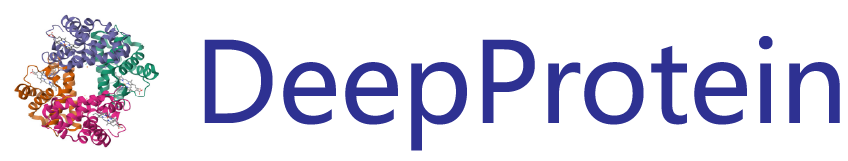

<p align="center"></p>

<h3 align="center">
<p> ProB: Learning Based Protein Benchmark <br></h3>
<h4 align="center">
<p> ... </h4>

---

[](https://pypi.org/project/ProB/)
[](https://pepy.tech/project/ProB)
[](https://pepy.tech/project/ProB)
[](https://github.com/jiaqingxie/DeepPurposePlusPlus/stargazers)
[](https://github.com/jiaqingxie/DeepPurposePlusPlus/network/members)

### Installation

First we recommend you to follow the instruction of how DeepPurpose's dependencies are installed.
```bash
conda create -n prob python=3.9
conda activate prob
pip install git+https://github.com/bp-kelley/descriptastorus
pip install lmdb
pip install DeepPurpose
```

A version of torch 2.1+  is required to installed, since dgl required a version of torch >=2.1.0. 

1. If you want to use GPU, then firstly find a matched torch version, then install dgl with cuda version. We give an example of torch 2.3.0 with cuda 11.8:
    ```bash
   pip install torch==2.3.0 torchvision==0.18.0 torchaudio==2.3.0 --index-url https://download.pytorch.org/whl/cu118
   conda install -c dglteam/label/th23_cu118 dgl
   ```
2. If you are not using a GPU, then follow this:
    ```bash
    pip install torch==2.3.0 torchvision==0.18.0 torchaudio==2.3.0 --index-url https://download.pytorch.org/whl/cpu
    conda install -c dglteam/label/th23_cpu dgl
    ```


## Encodings

Thanks to DeepPurpose and dgllife, we could borrow some of the encodings from DeepPurpose. The new added encodings are PAGTN, 
EGT and Graphormer which belong to graph transformer modules that are prevailing methods
these years for encoding protein graphs.

Currently, we support the following encodings:

| Drug Encodings  | Description                                     |
|-----------------|-------------------------------------------------|
| CNN             | Convolutional Neural Network on SMILES          |
| CNN_RNN         | A GRU/LSTM on top of a CNN on SMILES            |
| Transformer     | Transformer Encoder on ESPF                     |
| MPNN            | Message-passing neural network                  |
| DGL_GCN         | Graph Convolutional Network                     |
| DGL_NeuralFP    | Neural Fingerprint                              |
| DGL_AttentiveFP | Attentive FP, Xiong et al. 2020                 |
| DGL_GAT         | Graph Attention Network                         |
| PAGTN           | Path Augmented Graph Transformer Network        |
| EGT             | Edge Augmented Graph Transformer                |
| Graphormer      | Do Transformers Really Perform Bad, Ying et al. |


### 1. Protein Function (Property) Prediction


Done: 
1. Dataset Built for: Fluorescence Dataset 

test on the CNN probing on the Fluorescence dataset

```python
python CNN_Fluroscence.py
```

test on the GCN probing on the Fluorescence dataset

```python
python GCN_Fluroscence.py
```


TODO: 
1. ProtBert test on Fluorescence Dataset 
2. ProtAlbert test on Fluorescence Dataset
3. ESM-Gearnet test on Fluorescence Dataset
3. Transformer test on Fluorescence Dataset
4. Flow test on Fluorescence Datasets

```python
python test.py
```
